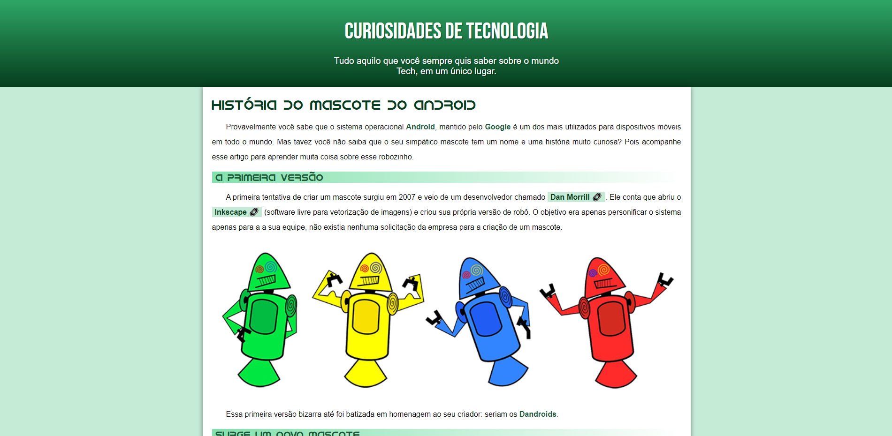
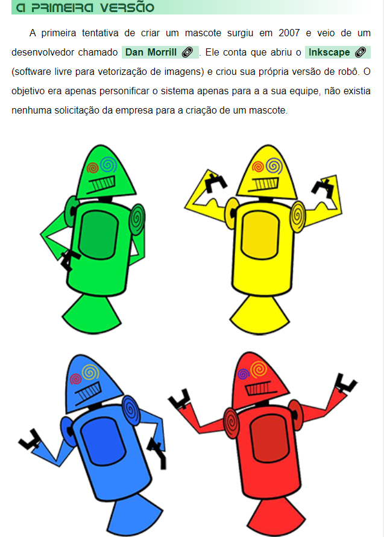
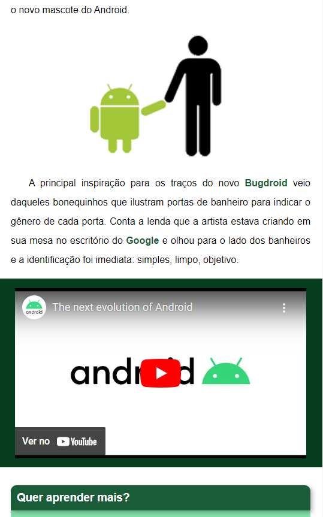

<h1 align="center"> Site - Projeto Android </h1>

  <a href="#-tecnologias">Tecnologias</a>&nbsp;&nbsp;&nbsp;|&nbsp;&nbsp;&nbsp;
  <a href="#-projeto">Projeto</a>&nbsp;&nbsp;&nbsp;|&nbsp;&nbsp;&nbsp;
  <a href="#memo-licença">Licença</a>

  

 

  

<h2 align="center">
    Site responsivo.
</h2>

  

  

## 🚀 Tecnologias

Esse projeto foi desenvolvido com as seguintes tecnologias:

- HTML e CSS
- Git e Github

## 💻 Projeto

Site que conta a história do mascote do Android, projeto desenvolvido com HTML e CSS. Site responsivo, consegue se adaptar ao tamanho da tela que está sendo exibido.

## :memo: Licença

Esse projeto está sob a licença MIT.

---
